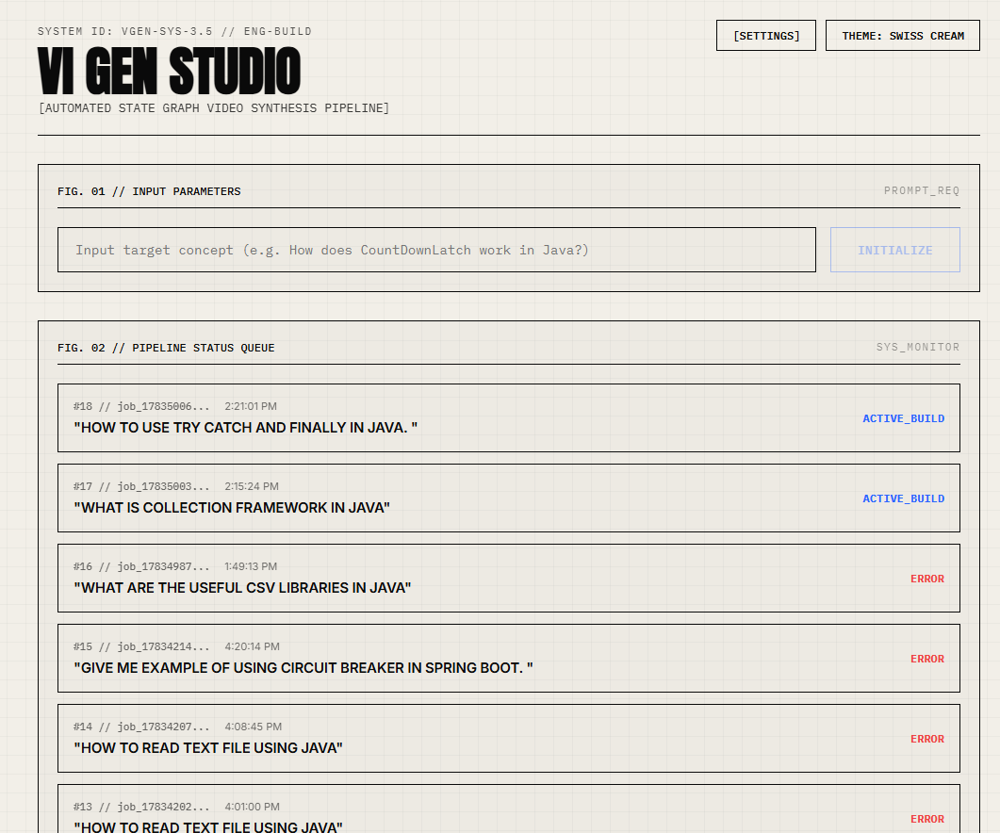
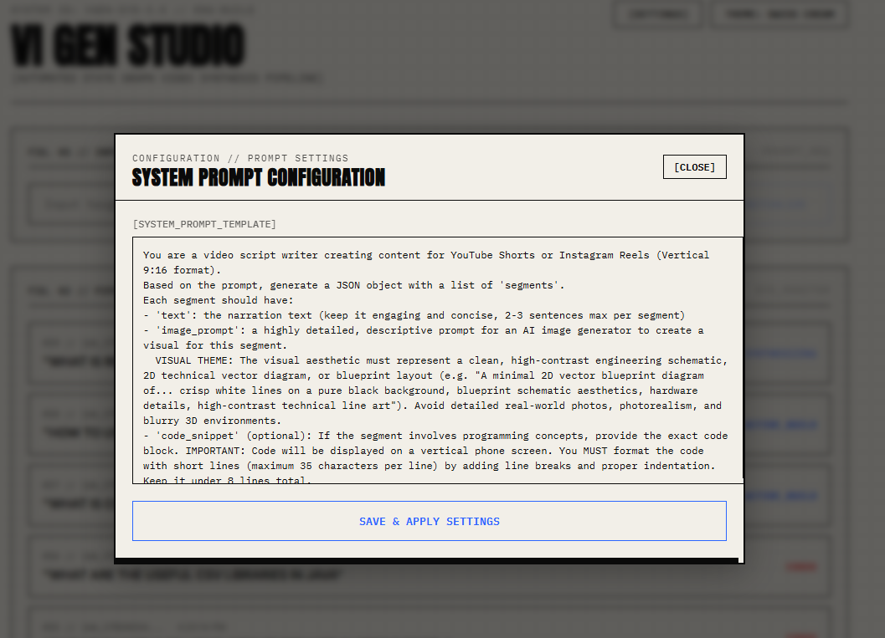
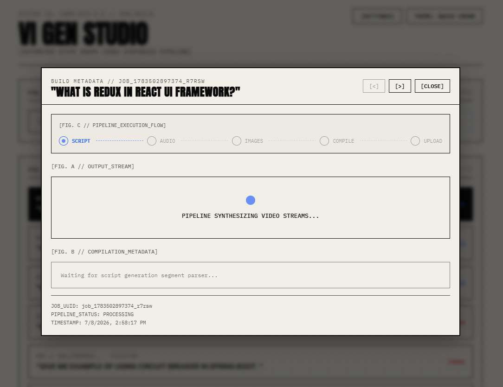
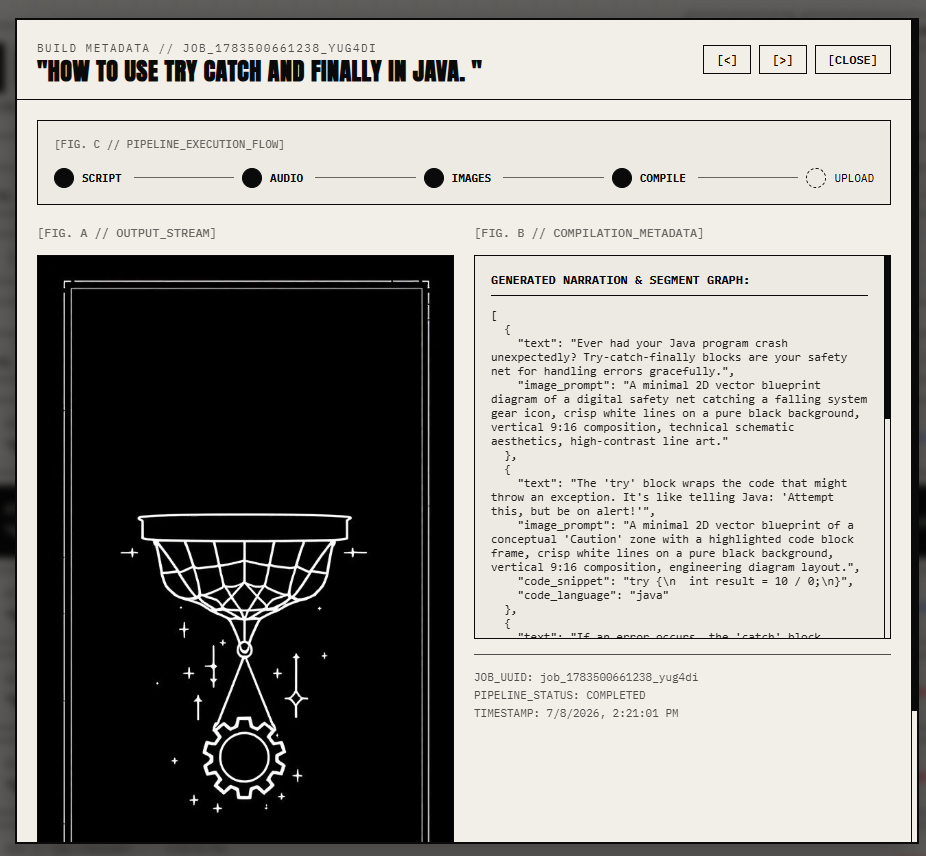
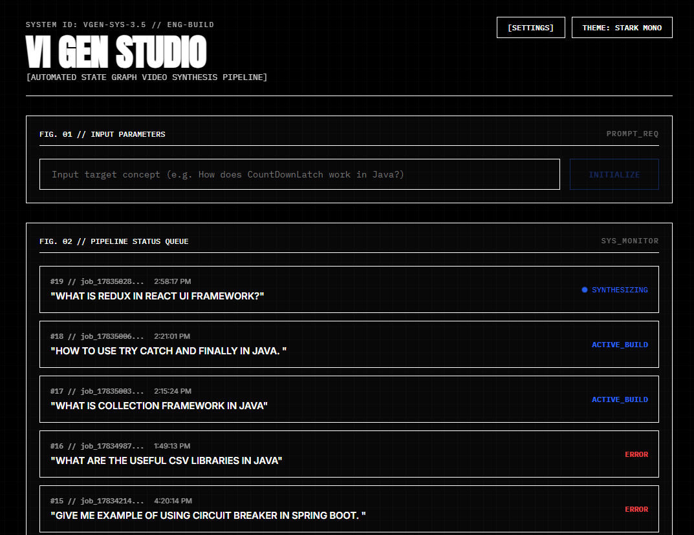

# VI Gen: AI Video Generation Pipeline

VI Gen is an automated pipeline that takes a simple text prompt and generates a fully produced, multi-segment video complete with dynamic AI-generated images, custom overlay code snippets, programmatic cheatsheet infographics, and a natural AI voiceover.

---

## Application Interface Preview

Below is a preview of the ViGen Studio interface, showcasing the high-contrast technical schematic dashboard, dynamic prompt configuration, multi-stage pipeline progress visualizer, and togglable light/dark themes:

| 🖥️ Main Dashboard Layout | ⚙️ Dynamic System Prompt Settings |
|:---:|:---:|
|  |  |

| 🔄 Active Job Synthesis / Progress Tracking | 📽️ Completed Build Preview & Live Stage Visualizer |
|:---:|:---:|
|  |  |

| 🌗 Swiss Cream vs. Stark Mono Theme Toggle |
|:---:|
|  |

---

## Core Features

- **⚡ Interactive Timeline Workstation**: 
  - Add segments dynamically with a single click.
  - Reorder, modify narration text, customize visual prompts, or delete segments.
  - Force individual segment regenerations or trigger full video recompilation.
- **📊 Programmatic Infographic Cheatsheets**:
  - Automatically appends a high-contrast technical comparison grid or summary slide at the end of programming/system-design topics.
  - Programmatic rendering using Pillow guarantees 100% readable text, bypassing distorted LLM-generated images.
- **💻 Syntax-Highlighted Code Blocks**:
  - Pygments Monokai highlighting renders beautiful code snippet overlays on narrative slides.
  - Cheatsheet infographics support integrated, syntax-highlighted code example cards centered dynamically at the bottom.
- **✖️ Responsive Job Cancellation**:
  - Cancel long-running pipeline compilations immediately with the click of a button, halting worker processes instantly.
- **🔄 Step-Level Retry & Resumption**:
  - The state-graph preserves and caches successfully compiled assets (narrations, images, scripts).
  - Retrying a failed or cancelled job resumes execution from the exact step and segment where it stopped, saving Together AI API tokens.
- **🎨 Stark Mono & Swiss Cream Dual Theme**:
  - Switch between a retro stark terminal aesthetic and a premium cream design theme with one click.

---

## Architecture

The project is structured as a microservices architecture managed via Docker Compose:
- **UI (Vite/React)**: A schematic dashboard interface for controlling pipelines, timelines, and monitoring progress.
- **API Gateway (Node.js/Express)**: Handles segment management, databases, and enqueues tasks.
- **Redis Queue**: Serves as the message broker passing execution payloads to the worker.
- **Postgres Database**: Persistent storage for job metadata, step status execution logs, and prompt settings.
- **Worker (Python/LangGraph)**: The execution engine compiling state-graph loops.

### The LangGraph Worker Workflow
1. **Script Generation**: An LLM (Ollama, OpenAI, or Together AI) writes a multi-segment script. If tech-related, it appends a structured cheatsheet data schema.
2. **Audio Synthesis**: Uses local [Kokoro](https://github.com/hexgrad/kokoro) text-to-speech to compile ultra-realistic voice narration files.
3. **Image Generation**: Together AI creates 2D blueprint illustrations for normal segments, while Pillow programmatically draws tabular comparison grids and code snippet cards for cheatsheet summaries.
4. **Video Compilation**: MoviePy concatenates all assets, syncs video lengths precisely with the audio tracks, and outputs the final `.mp4`.
5. **Auto-Upload**: Optionally logs into Instagram to publish the Reel.

---

## Prerequisites

- **Docker** and **Docker Compose**
- **Ollama** (Optional, if using `ollama` as your local LLM provider)
- **API Keys**:
  - Together AI API Key (Required for Image Generation and optional for Script Generation)
  - OpenAI API Key (Optional, if using `openai` as your LLM provider)

---

## Configuration

All credentials and API selections are configured inside the `.env` file at the root directory:

| Variable | Description | Default |
|----------|-------------|---------|
| `LLM_PROVIDER` | The LLM engine to use for writing scripts (`ollama`, `openai`, `together`). | `together` |
| `LLM_MODEL` | Specific text model name (e.g., `meta-llama/Llama-3-70b-chat-hf`). | `meta-llama/Llama-3-70b-chat-hf` |
| `IMAGE_MODEL` | Image model name (e.g. `black-forest-labs/FLUX.1-schnell`). | `black-forest-labs/FLUX.1-schnell` |
| `TOGETHER_API_KEY` | Required for image generation and Together AI LLM execution. | *(Your Key)* |
| `OPENAI_API_KEY` | Required only if `LLM_PROVIDER=openai`. | *(Your Key)* |
| `OLLAMA_URL` | The endpoint for local Ollama instances. | `http://host.docker.internal:11434` |
| `IG_USERNAME` | Optional. Username for automated Instagram Reels upload. | *(Your Username)* |
| `IG_PASSWORD` | Optional. Password for automated Instagram Reels upload. | *(Your Password)* |
| `GMAIL_USERNAME` | Optional. Gmail address to intercept Instagram verification challenges. | *(Your Email)* |
| `GMAIL_APP_PASSWORD` | Optional. App Password for IMAP access. | *(Your App Password)* |

---

## Getting Started

1. **Clone the Project & Configure `.env`**
   ```env
   LLM_PROVIDER=together
   LLM_MODEL=meta-llama/Llama-3-70b-chat-hf
   IMAGE_MODEL=black-forest-labs/FLUX.1-schnell
   TOGETHER_API_KEY=your_together_key_here
   ```
   
2. **Build and Spin Up Containers**
   ```bash
   docker compose up -d --build
   ```

3. **Access Control Panels**
   - **ViGen Dashboard UI**: Navigable at `http://localhost:5173`
   - **Express Gateway**: Available on `http://localhost:3000`

4. **Watch Worker Pipelines**
   ```bash
   docker compose logs -f video-render-worker
   ```

---

## Output

All generated audio segments, raw image frames, code block outputs, and final `.mp4` video compilations are saved in the `./output` folder in the project root.
